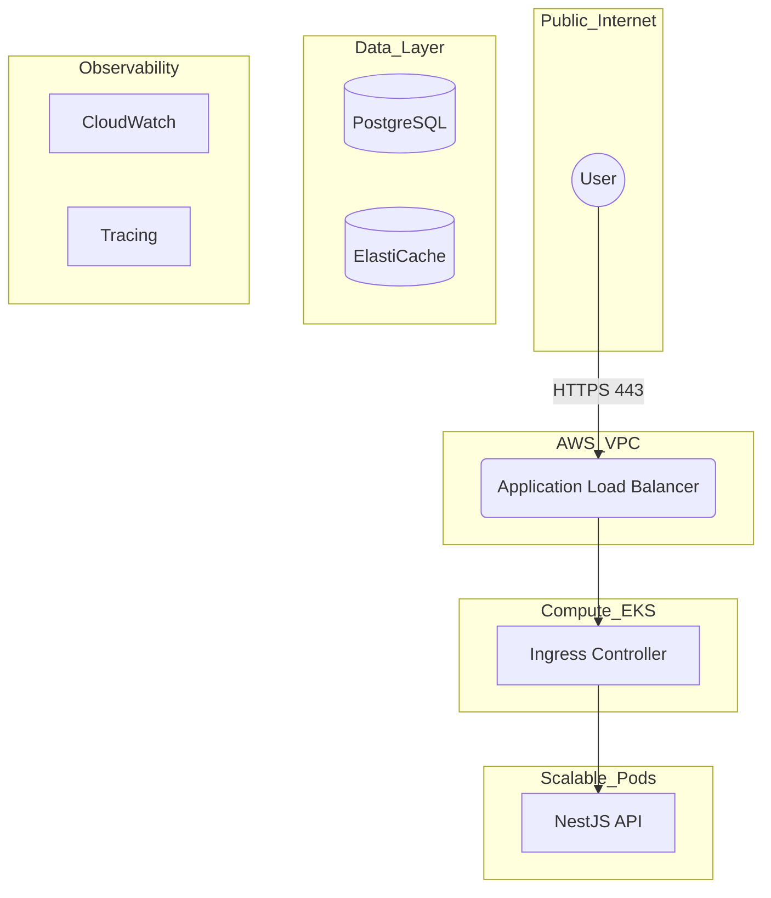

# Capital CRM - Nx Monorepo

<p align="center">
  
  
  
  
  
  
</p>

---

## 📌 Table of Contents

- [Capital CRM - Nx Monorepo](#capital-crm---nx-monorepo)
  - [📌 Table of Contents](#-table-of-contents)
  - [🧭 Executive Summary](#-executive-summary)
    - [Key Objectives](#key-objectives)
  - [☁️ Cloud‑Native Architecture](#️-cloudnative-architecture)
  - [🧰 Technology Stack](#-technology-stack)
  - [🧩 Development Workflow](#-development-workflow)
    - [Requirements](#requirements)
    - [Quick Start](#quick-start)
    - [Default Services](#default-services)
  - [🐳 Docker Orchestration](#-docker-orchestration)
  - [🧩 Nx Targets](#-nx-targets)
  - [🔍 Observability](#-observability)
  - [⚙️ CI/CD](#️-cicd)
  - [📁 Project Structure](#-project-structure)

---

## 🧭 Executive Summary

Capital CRM is a high-performance platform built to support enterprise client intelligence, valuation tracking, and secure audit history. This project demonstrates a production-ready application implemented using an **Nx Monorepo**, enabling consistent, scalable, and automated full‑stack development.

### Key Objectives

- Unified frontend and backend dependency graph with Nx
- Strict linting and formatting rules enforced on commit and CI
- Consistent containerized execution with Docker Compose
- Structured metrics, logs, and health endpoints
- Segmented CI/CD pipelines based on changed scopes

---

## ☁️ Cloud‑Native Architecture



---

## 🧰 Technology Stack

| Domain   | Technology       | Purpose                                     |
| -------- | ---------------- | ------------------------------------------- |
| Monorepo | Nx               | Caching, computation graph, affected builds |
| Backend  | NestJS           | Modular architecture, DI, TypeScript safety |
| Frontend | React + Vite     | High‑performance SPA with Tailwind/ShadCN   |
| ORM      | TypeORM          | Migrations, schema typing, domain models    |
| Database | PostgreSQL       | Financial integrity and reporting accuracy  |
| Runtime  | Docker + Compose | Dev, CI, and production parity              |

---

## 🧩 Development Workflow

### Requirements

- Docker
- Docker Compose

### Quick Start

```bash
docker compose up --build
```

> The first run seeds the database and provisions the initial admin user.

### Default Services

- Frontend: [http://localhost:5173](http://localhost:5173)
- API: [http://localhost:3000/docs](http://localhost:3000/docs)
- Metrics: [http://localhost:3000/api/metrics](http://localhost:3000/api/metrics)

---

## 🐳 Docker Orchestration

Each application defines its own docker‑compose workflow, allowing isolated development and Nx‑controlled execution.

Example: `apps/back-end/docker-compose.yml`

---

## 🧩 Nx Targets

> Nx targets enable isolated orchestration of Docker services via CLI.

```bash
nx run back-end:docker-up
nx run back-end:docker-down
nx run back-end:docker-logs
```

Common scripts include database bootstrapping, rebuild, logs, migrations, and seed operations.

---

## 🔍 Observability

- JSON structured logging using `nestjs-pino`
- `/healthz` probe endpoint (Kubernetes‑compatible)
- `/metrics` exposure in Prometheus format

---

## ⚙️ CI/CD

- Affected‑based pipelines (Frontend / Backend) triggered independently
- Unit tests required prior to merge
- Docker multi‑stage build validation
- Lint enforcement rejecting `any` usage

---

## 📁 Project Structure

```
capital-crm/
├─ apps/
│  ├─ back-end/
│  ├─ front-end/
└─ nx.json
```

---
