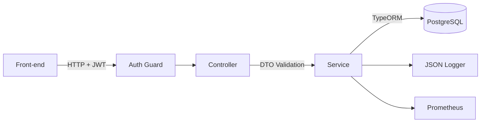

# 🚀 Capital CRM API — Backend Service

A production-grade REST API responsible for **authentication**, **customer management**, **wallet control**, **value tracking**, and **observability**.

Built with **NestJS** using modular architecture and domain-driven design principles, ensuring scalability, maintainability, and clear separation of concerns.

---

## 📌 Badges


---

## 📚 Table of Contents

- [Architecture Overview](#architecture-overview)
- [Tech Stack](#tech-stack)
- [Getting Started](#getting-started)
- [Environment Variables](#environment-variables)
- [Database & Migrations](#database--migrations)
- [API Documentation (Swagger)](#api-documentation-swagger)
- [Observability](#observability)
- [Testing](#testing)
- [Troubleshooting](#troubleshooting)
- [Nx Commands](#nx-commands)

---

## 🧩 Architecture Overview

The backend operates as a stateless microservice with clear separation between **Controllers**, **Services**, and **Repositories**.



---

## 🛠 Tech Stack

| Category      | Technology        | Purpose                        |
| ------------- | ----------------- | ------------------------------ |
| Framework     | NestJS            | Modular application framework  |
| Language      | TypeScript        | Strong typing                  |
| Database      | PostgreSQL 15     | Relational persistence         |
| ORM           | TypeORM           | Database access and migrations |
| Validation    | class-validator   | DTO validation                 |
| Logging       | nestjs-pino       | Structured JSON logs           |
| Metrics       | nestjs-prometheus | Metrics endpoint `/metrics`    |
| Documentation | Swagger           | Automatic API UI               |

---

## 🚦 Getting Started

### Prerequisites

- Node.js ≥ 20
- Docker + Docker Compose

### 1. Start PostgreSQL

```bash
docker-compose up -d postgres
```

### 2. Install dependencies

```bash
npm install
```

### 3. Run the API (Nx)

```bash
npx nx serve back-end
```

API available at:

```
http://localhost:3000/api
```

---

## 🔐 Environment Variables

Developers **must create a `.env` file** based on the `.env.example` file provided in the project. All variables are validated on startup; missing or invalid values will prevent the application from running.

### Application

| Variable   | Type   | Description         | Allowed values                      | Default                                    |
| ---------- | ------ | ------------------- | ----------------------------------- | ------------------------------------------ |
| `PORT`     | number | HTTP server port    | `>= 1`                              | defined in `.env.example` (usually `3000`) |
| `NODE_ENV` | enum   | Runtime environment | `development`, `production`, `test` | `development`                              |

### Logging

| Variable     | Type             | Description                                                      | Allowed values                                     | Default |
| ------------ | ---------------- | ---------------------------------------------------------------- | -------------------------------------------------- | ------- |
| `LOG_LEVEL`  | enum             | Minimum log level emitted by the application                     | `fatal`, `error`, `warn`, `info`, `debug`, `trace` | `info`  |
| `LOG_PRETTY` | boolean (string) | Enables pretty-print logs (human readable) for local development | `'true'` (pretty), `'false'` (JSON only)           | `false` |

> `LOG_PRETTY` is defined as a string in `.env` and interpreted as `true` only when its value is exactly `"true"`.

### Database

| Variable      | Type   | Description       | Example          |
| ------------- | ------ | ----------------- | ---------------- |
| `DB_HOST`     | string | Database host     | `localhost`      |
| `DB_PORT`     | number | Database port     | `5432`           |
| `DB_USERNAME` | string | Database user     | `admin`          |
| `DB_PASSWORD` | string | Database password | `admin`          |
| `DB_DATABASE` | string | Database name     | `capital_crm_db` |

### Authentication & Admin

| Variable         | Type           | Description                                         | Default               |
| ---------------- | -------------- | --------------------------------------------------- | --------------------- |
| `JWT_SECRET`     | string         | Secret key used to sign JWT tokens (min length: 16) | required (no default) |
| `JWT_EXPIRES_IN` | string         | Token expiration interval (Nest/JWT format)         | `1d`                  |
| `ADMIN_EMAIL`    | string (email) | Initial administrator user e-mail address           | required              |
| `ADMIN_PASSWORD` | string         | Initial administrator user password                 | required              |

### Seed & Misc

| Variable         | Type             | Description                                                     | Default |
| ---------------- | ---------------- | --------------------------------------------------------------- | ------- |
| `SEED_MOCK_DATA` | boolean (string) | Enables loading mock/seed data on startup for local development | `false` |

> Boolean flags such as `SEED_MOCK_DATA` are interpreted as `true` only when the value is exactly `"true"` in the `.env` file.

---

## 🗄 Database & Migrations

Database schema changes are managed through TypeORM migrations. Direct SQL changes in the database are not allowed.

### Generate a new migration

```bash
npx nx run back-end:migration-generate --name=AddPhoneField
```

This command creates a new migration file under:

```text
apps/back-end/src/database/migrations
```

### Run all pending migrations

```bash
npx nx run back-end:migration-run
```

### Run custom TypeORM commands

For advanced use (e.g. `migration:show`), you can call the generic `typeorm` target and pass the desired CLI command:

```bash
npx nx run back-end:typeorm -- migration:show
```

### Seed development data

```bash
npx nx run back-end:seed-run
```

This executes the `src/database/seeds/main.seed.ts` script to populate the database with seed data for local development.

---

### Generate migration

```bash
npm run typeorm:generate -- apps/back-end/src/migrations/<MigrationName>
```

### Run migrations

```bash
npm run typeorm:run
```

### Revert last migration

```bash
npm run typeorm:revert
```

---

## 📖 API Documentation (Swagger)

- UI: [http://localhost:3000/docs](http://localhost:3000/docs)
- JSON: [http://localhost:3000/docs-json](http://localhost:3000/docs-json)

### Basic flow

1. Authenticate using `POST /auth/login`
2. Copy the JWT token
3. Click "Authorize" in Swagger UI

---

## 📈 Observability

### Logging

- Structured JSON logs
- Request-scoped metadata
- Log levels and context

### Metrics

- Endpoint: `/metrics`
- Suitable for Prometheus + Grafana dashboards

### Healthchecks

- Endpoint: `/healthz`
- Returns **503** if database connection fails

---

## 🧪 Testing

### Unit tests (Jest)

```bash
npx nx test back-end
```

### Coverage report

```bash
npx nx test back-end --coverage
```

### End-to-end tests

```bash
npx nx e2e back-end-e2e
```

---

## 🩺 Troubleshooting

**Database connection errors**

- Ensure Docker is running: `docker ps`

**Swagger not available**

- Verify `NODE_ENV`

**Migrations fail**

- Run:

```bash
npx nx reset
```

---

## ⚡ Nx Commands

```bash
# Development server
npx nx serve back-end

# Unit tests
npx nx test back-end
npx nx test back-end --coverage

# Lint & format
npx nx lint back-end
npx nx format

# Reset Nx cache
npx nx reset

# Database helpers (Docker + Postgres)
npx nx run back-end:db-up           # start Postgres container
npx nx run back-end:db-stop         # stop Postgres container
npx nx run back-end:db-nuke         # stop and remove Postgres volumes

# Full stack via Docker Compose
npx nx run back-end:docker-up       # build and start API + dependencies
npx nx run back-end:docker-down     # stop all containers
npx nx run back-end:docker-logs     # follow logs of all containers
npx nx run back-end:docker-api-rebuild # rebuild only API container
npx nx run back-end:docker-api-stop    # stop only API container

# Migrations and seeds
npx nx run back-end:migration-generate --name=AddPhoneField
npx nx run back-end:migration-run
npx nx run back-end:seed-run
```
